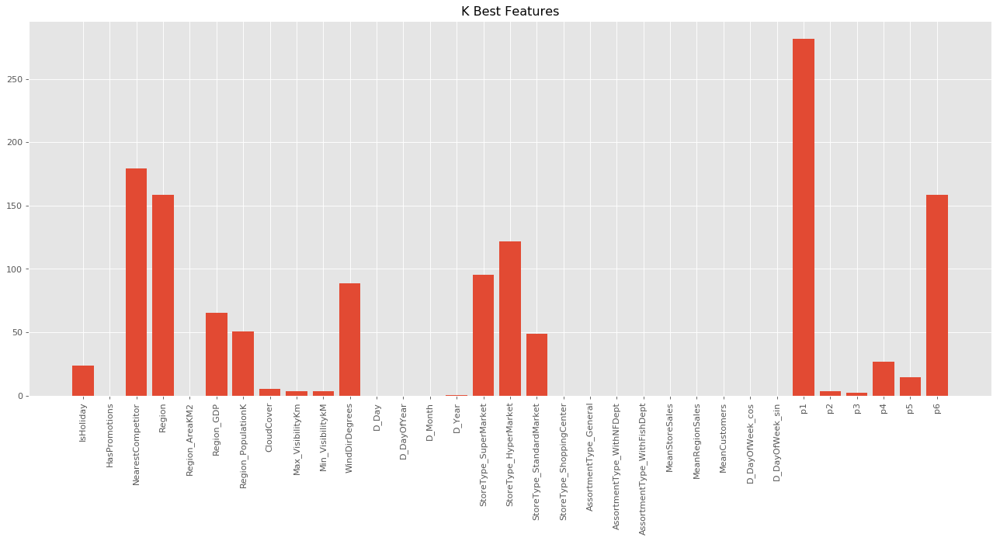
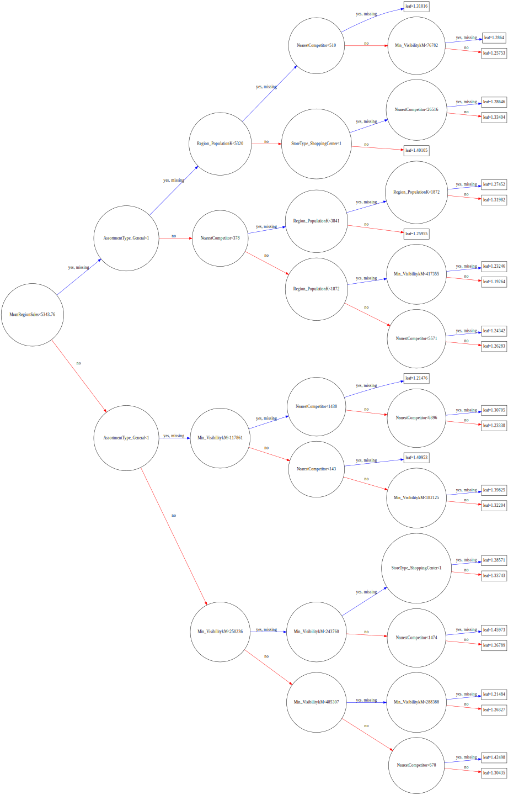
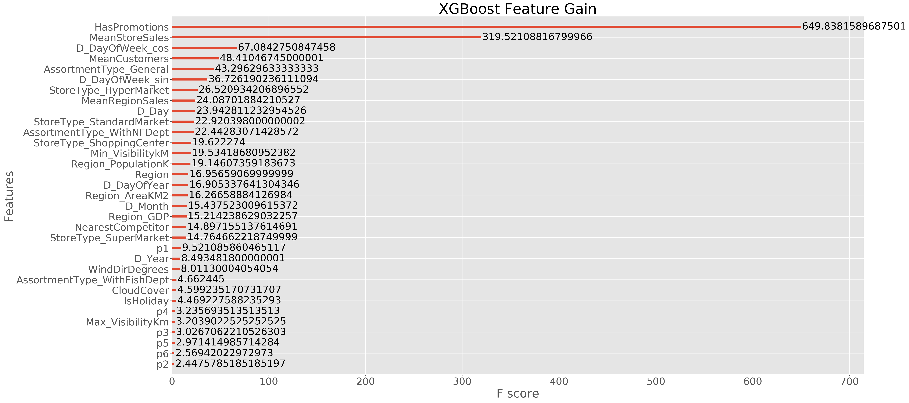
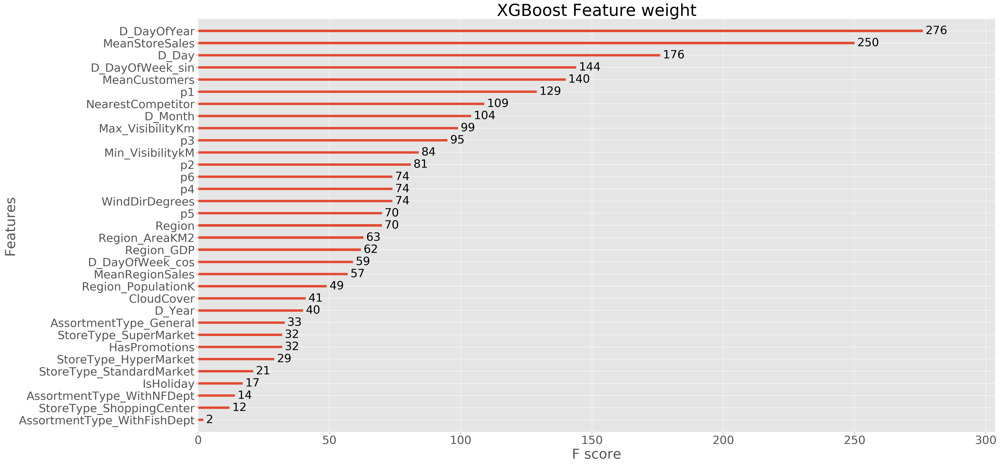
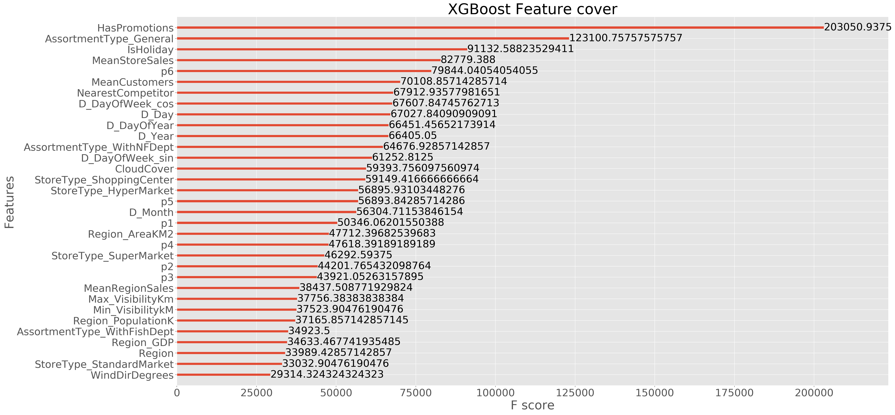
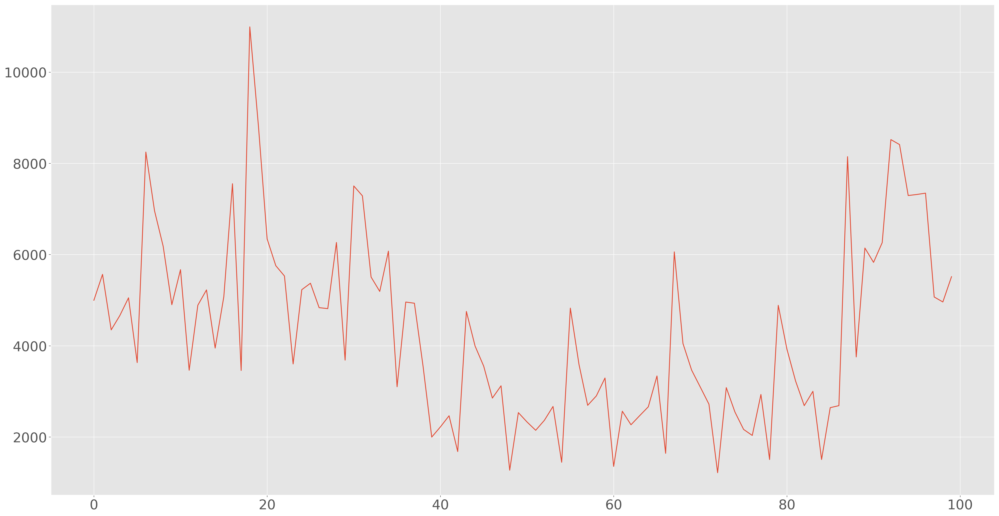
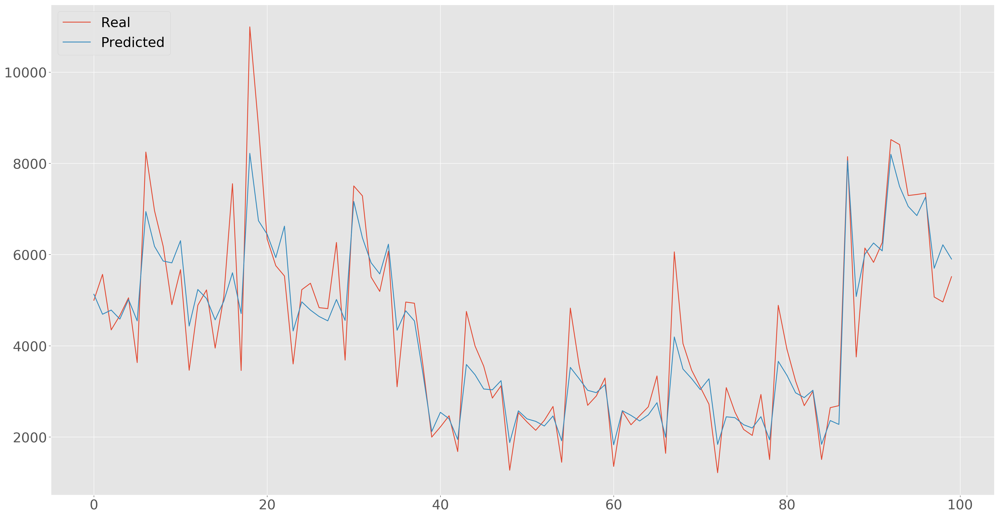

# XGBoost model
eXtreme Gradient Boosting ([XGBoost](https://github.com/dmlc/xgboost/blob/master/doc/model.md)) is an implementation of gradient boosted decision trees designed for speed and performance.
This notebook implements the final model of XGBoost used in our analysis.
Since it was not easy to integrate our custom evaluation function (BIP_error), we tried to minimize many built-in evaluation metrics of the XGBoost library (mae, rmse..), and then used the one that produced the best results in term of BIP_error, which in this case was rmse.

#### Feature selection
The feature selection was performed both by using the feature_selection library of SciKitLearn and by increasingly excluding the least important features that were detected by the model and plot after the training of the model

#### Hyperparameters Tuning
The tuning of the Hyperparameters for XGBoost was done using the RandomizedSearchCV method and using SciKitLearn wrapper of XGBoost (XGBRegressor) with a 5-fold cross-validation on 30% of the train test and providing it the parameters: gamma, learning_rate, max_depth, reg_alpha onto which apply the Grid Search. The best parameters it found were: {'gamma': 14.557397447034148, 'learning_rate': 0.17070528151248315, 'max_depth': 16, 'reg_alpha': 11.010959407512171}, however, testing the parameters with our train-test split policy did not produce better results than the parameters found by manually try some combinations, thus, in the end we modified them.

#### Train-test split
Initially we split train and test sets with the train_test_split in model_selection of SciKitLearn, the results were too optimistic and then we decided to split in a way that would result in having a test set similar to the one we were going to be evaluated on, so we selected some test sets a pair of months in the 24 months of the train, in particular we concentrated on the pairs that seemed more significant in our analysis based on the real test we would have had to predict in the end which are:
* January and February 2018
* March and April 2017
* March and April 2016

The first one because it is the last 2 months we have and in a way this captures the real test set we have to predict, the other two were chosen because the real test set is for March and April.


```python
import pandas as pd
import numpy as np
from sklearn.model_selection import cross_validate
import xgboost as xgb

from sklearn.model_selection import train_test_split
from sklearn.model_selection import cross_val_score
from sklearn.model_selection import GridSearchCV
from sklearn.model_selection import RandomizedSearchCV
from sklearn.model_selection import validation_curve

import matplotlib.pyplot as plt
%matplotlib inline

from RMSE import rmspe,rmspe_xg
import modify_dataset as md
```


```python
df = pd.read_csv("dataset/preprocessed_train_PCA.csv")
```


```python
df = df.drop(['NumberOfCustomers'], axis=1)
#OHE attr.
df = df.drop(['StoreType','AssortmentType','Events'], axis=1)
#only for pca dataset
df = df.drop(['Unnamed: 0'], axis=1)
```


```python
df.shape
```


    (433958, 44)


```python
train = md.get_fake_train4(df)
```


```python
train.shape
```


    (397455, 44)


```python
test = md.get_fake_test4(df)
test.shape
```


    (36503, 44)


### Selecting predictive features 


```python
from pprint import pprint
features = list(train.columns.values)
features.remove('NumberOfSales')
features.remove('StoreID')
features.remove('D_DayOfweek')
features.remove('Date')
features.remove('MeanRegionCustomers')

features.remove('p11')
features.remove('p12')
features.remove('p7')
features.remove('p9')
#4.5%

features.remove('p8')
features.remove('p10')
#4.2%
print("features:")

pprint(features)
```

    features:
    ['IsHoliday',
     'HasPromotions',
     'NearestCompetitor',
     'Region',
     'Region_AreaKM2',
     'Region_GDP',
     'Region_PopulationK',
     'CloudCover',
     'Max_VisibilityKm',
     'Min_VisibilitykM',
     'WindDirDegrees',
     'D_Day',
     'D_DayOfYear',
     'D_Month',
     'D_Year',
     'StoreType_SuperMarket',
     'StoreType_HyperMarket',
     'StoreType_StandardMarket',
     'StoreType_ShoppingCenter',
     'AssortmentType_General',
     'AssortmentType_WithNFDept',
     'AssortmentType_WithFishDept',
     'MeanStoreSales',
     'MeanRegionSales',
     'MeanCustomers',
     'D_DayOfWeek_cos',
     'D_DayOfWeek_sin',
     'p1',
     'p2',
     'p3',
     'p4',
     'p5',
     'p6']
    

### SciKitLearn feature selection


```python
plt.style.use('ggplot')
plt.rcParams['figure.figsize'] = (15, 6)
plt.rcParams['figure.figsize'] = [20.0,8.0]
plt.rcParams['figure.dpi']=80
```


```python
from sklearn.feature_selection import SelectKBest, f_classif, f_regression

# Perform feature selection
selector = SelectKBest(f_regression, k=20)
selector.fit(train[features], train['NumberOfSales'])

# Get the raw p-values for each feature, and transform from p-values into scores
scores = -np.log10(selector.pvalues_)

# Plot the scores for each feature 
plt.bar(range(len(features)), scores)
plt.xticks(range(len(features)), features, rotation='vertical')
plt.title('K Best Features')
plt.show()
```

    C:\Users\Mirko\Anaconda3\lib\site-packages\ipykernel_launcher.py:8: RuntimeWarning: divide by zero encountered in log10
      
    





## Hyperparameters tuning (it takes a lot of time)


```python
#from xgboost.sklearn import XGBRegressor # wrapper
## XGB with sklearn wrapper
## the same parameters as for xgboost model
#params_sk = {'max_depth': 8, 
#            'n_estimators': 100, # the same as num_rounds in xgboost
#            'objective': 'reg:linear', 
#            'subsample': 1.0, 
#            'colsample_bytree': 0.3, 
#            'learning_rate': 0.1, 
#            'seed': 23}     
#
#skrg = XGBRegressor(**params_sk)
#
#skrg.fit(X_train[features], np.log(X_train["NumberOfSales"] + 1))
```


```python
#import scipy.stats as st
#
#params_grid = {  
#    'learning_rate': st.uniform(0.001, 0.2),
#    'max_depth': list(range(6, 20, 2)),
#    'gamma': st.uniform(0, 40),
#    'reg_alpha': st.expon(0, 40)}
#
#search_sk = RandomizedSearchCV(skrg, params_grid, cv = 3, verbose=2) # 3 fold cross validation
#search_sk.fit(X_test[features], np.log(X_test["NumberOfSales"] + 1))
#
## best parameters
#print(search_sk.best_params_); print(search_sk.best_score_)
```

### Hyperparameters tuning result
The result was obtained using 0.3 of the train set (22 months) at random.
#### Result
{'gamma': 14.557397447034148, 'learning_rate': 0.17070528151248315, 'max_depth': 16, 'reg_alpha': 11.010959407512171}
0.8171277539145538

DMatrix of train and test, NumberOfSales transformes to log + 1 to improve prediction result


```python
dtrain = xgb.DMatrix(train[features], np.log(train["NumberOfSales"] + 1))
dvalid = xgb.DMatrix(test[features], np.log(test["NumberOfSales"] + 1))
#dtest = xgb.DMatrix(test[features])
```


```python
#Using tuned params
params = {"objective": "reg:linear",
          "eta": 0.2,   #0.17
          "max_depth": 5,
          "subsample": 0.8,  #0.8
          "colsample_bytree": 0.3, #0.3 #0.2
          "silent": 1,
          "nthread":-1,
          #added as a test
          "eval_metric": "rmse",
          "gamma": 0.5, #2
          #"seed": 23,
          #"reg_alpha": 2  #4
          #"gamma": 14.5573974470,  #added as a test
          "reg_alpha": 1
          }

#reg_alpha 
#reg_lambda
num_trees = 100 #400
```


```python
watchlist = [(dvalid, 'test'), (dtrain, 'train')]
gbm = xgb.train(params, dtrain, num_trees, evals=watchlist, early_stopping_rounds=20, verbose_eval=True)
```

    [0]	test-rmse:6.29125	train-rmse:6.33636
    Multiple eval metrics have been passed: 'train-rmse' will be used for early stopping.
    
    Will train until train-rmse hasn't improved in 20 rounds.
    [1]	test-rmse:5.02897	train-rmse:5.07388
    [2]	test-rmse:4.01497	train-rmse:4.0641
    [3]	test-rmse:3.21412	train-rmse:3.25782
    [4]	test-rmse:2.56881	train-rmse:2.60954
    [5]	test-rmse:2.05255	train-rmse:2.0925
    [6]	test-rmse:1.6416	train-rmse:1.67935
    [7]	test-rmse:1.31514	train-rmse:1.35036
    [8]	test-rmse:1.05186	train-rmse:1.09057
    [9]	test-rmse:0.846124	train-rmse:0.882963
    [10]	test-rmse:0.683751	train-rmse:0.720882
    [11]	test-rmse:0.560339	train-rmse:0.592006
    [12]	test-rmse:0.463918	train-rmse:0.492657
    [13]	test-rmse:0.388646	train-rmse:0.411716
    [14]	test-rmse:0.336106	train-rmse:0.351831
    [15]	test-rmse:0.29935	train-rmse:0.309328
    [16]	test-rmse:0.275285	train-rmse:0.277295
    [17]	test-rmse:0.261209	train-rmse:0.25383
    [18]	test-rmse:0.245506	train-rmse:0.234389
    [19]	test-rmse:0.233503	train-rmse:0.21867
    [20]	test-rmse:0.226138	train-rmse:0.207768
    [21]	test-rmse:0.224507	train-rmse:0.201788
    [22]	test-rmse:0.223025	train-rmse:0.198293
    [23]	test-rmse:0.222682	train-rmse:0.195259
    [24]	test-rmse:0.22181	train-rmse:0.192055
    [25]	test-rmse:0.218619	train-rmse:0.188639
    [26]	test-rmse:0.218168	train-rmse:0.187353
    [27]	test-rmse:0.216928	train-rmse:0.185198
    [28]	test-rmse:0.216408	train-rmse:0.183944
    [29]	test-rmse:0.212528	train-rmse:0.180867
    [30]	test-rmse:0.21239	train-rmse:0.180188
    [31]	test-rmse:0.212396	train-rmse:0.179726
    [32]	test-rmse:0.213157	train-rmse:0.178552
    [33]	test-rmse:0.213039	train-rmse:0.178244
    [34]	test-rmse:0.21321	train-rmse:0.178043
    [35]	test-rmse:0.212612	train-rmse:0.177062
    [36]	test-rmse:0.210475	train-rmse:0.176677
    [37]	test-rmse:0.210246	train-rmse:0.17622
    [38]	test-rmse:0.210108	train-rmse:0.175913
    [39]	test-rmse:0.209598	train-rmse:0.175328
    [40]	test-rmse:0.209338	train-rmse:0.174966
    [41]	test-rmse:0.209284	train-rmse:0.174641
    [42]	test-rmse:0.208502	train-rmse:0.173735
    [43]	test-rmse:0.20851	train-rmse:0.173587
    [44]	test-rmse:0.208676	train-rmse:0.17348
    [45]	test-rmse:0.207323	train-rmse:0.172615
    [46]	test-rmse:0.206285	train-rmse:0.171871
    [47]	test-rmse:0.206225	train-rmse:0.17172
    [48]	test-rmse:0.206075	train-rmse:0.171395
    [49]	test-rmse:0.20517	train-rmse:0.170685
    [50]	test-rmse:0.203673	train-rmse:0.168932
    [51]	test-rmse:0.20261	train-rmse:0.168388
    [52]	test-rmse:0.200334	train-rmse:0.16719
    [53]	test-rmse:0.20037	train-rmse:0.167036
    [54]	test-rmse:0.199559	train-rmse:0.166647
    [55]	test-rmse:0.198309	train-rmse:0.165994
    [56]	test-rmse:0.197152	train-rmse:0.165836
    [57]	test-rmse:0.197063	train-rmse:0.165695
    [58]	test-rmse:0.196198	train-rmse:0.165602
    [59]	test-rmse:0.196077	train-rmse:0.165336
    [60]	test-rmse:0.195987	train-rmse:0.165218
    [61]	test-rmse:0.195544	train-rmse:0.164689
    [62]	test-rmse:0.195011	train-rmse:0.164123
    [63]	test-rmse:0.195149	train-rmse:0.163862
    [64]	test-rmse:0.19469	train-rmse:0.163322
    [65]	test-rmse:0.193909	train-rmse:0.162527
    [66]	test-rmse:0.194016	train-rmse:0.162257
    [67]	test-rmse:0.1938	train-rmse:0.161997
    [68]	test-rmse:0.193753	train-rmse:0.161853
    [69]	test-rmse:0.193844	train-rmse:0.161792
    [70]	test-rmse:0.193567	train-rmse:0.161473
    [71]	test-rmse:0.19357	train-rmse:0.161281
    [72]	test-rmse:0.193585	train-rmse:0.161244
    [73]	test-rmse:0.193808	train-rmse:0.161115
    [74]	test-rmse:0.19381	train-rmse:0.160953
    [75]	test-rmse:0.193741	train-rmse:0.160823
    [76]	test-rmse:0.193296	train-rmse:0.160424
    [77]	test-rmse:0.193063	train-rmse:0.160074
    [78]	test-rmse:0.192945	train-rmse:0.159839
    [79]	test-rmse:0.192925	train-rmse:0.159606
    [80]	test-rmse:0.192092	train-rmse:0.159115
    [81]	test-rmse:0.191817	train-rmse:0.158664
    [82]	test-rmse:0.191821	train-rmse:0.158433
    [83]	test-rmse:0.191364	train-rmse:0.157917
    [84]	test-rmse:0.191273	train-rmse:0.157835
    [85]	test-rmse:0.19133	train-rmse:0.157762
    [86]	test-rmse:0.19137	train-rmse:0.157362
    [87]	test-rmse:0.191167	train-rmse:0.157072
    [88]	test-rmse:0.191279	train-rmse:0.157042
    [89]	test-rmse:0.191179	train-rmse:0.156725
    [90]	test-rmse:0.191208	train-rmse:0.156579
    [91]	test-rmse:0.191117	train-rmse:0.156387
    [92]	test-rmse:0.19111	train-rmse:0.156305
    [93]	test-rmse:0.19111	train-rmse:0.156269
    [94]	test-rmse:0.191027	train-rmse:0.156156
    [95]	test-rmse:0.191062	train-rmse:0.156117
    [96]	test-rmse:0.19104	train-rmse:0.156005
    [97]	test-rmse:0.191041	train-rmse:0.155984
    [98]	test-rmse:0.191075	train-rmse:0.155912
    [99]	test-rmse:0.190706	train-rmse:0.155414
    

### Plotting Trees


```python
plt.style.use('ggplot')
plt.rcParams['figure.figsize'] = (15, 6)
plt.rcParams['figure.figsize'] = [40.0,20.0]
plt.rcParams['figure.dpi']=400
plt.rcParams.update({'font.size': 30})
```


```python
from xgboost import plot_tree

```


```python
xgb.to_graphviz(gbm, num_trees=1, rankdir='LR', **{'size':str(20)})
```





### Validating


```python
print("Validating")
train_probs = gbm.predict(xgb.DMatrix(test[features]))
indices = train_probs < 0
train_probs[indices] = 0
error = rmspe(np.exp(train_probs) - 1, test['NumberOfSales'].values)
print('error', error)
```

    Validating
    error 0.1677549715005141
    

RMSE

## Feature importance analysis:


```python
plt.style.use('ggplot')
plt.rcParams['figure.figsize'] = (15, 6)
plt.rcParams['figure.figsize'] = [30.0,16.0]
plt.rcParams['figure.dpi']=200
plt.rcParams.update({'font.size': 24})
```


```python
# # Feature importance XGB for all features 
from xgboost import plot_importance
plot_importance(gbm, importance_type="gain")
plt.title("XGBoost Feature Gain")
plt.show()
```





```python
# # Feature importance XGB for all features 
from xgboost import plot_importance
plot_importance(gbm, importance_type="weight")
plt.title("XGBoost Feature weight")
plt.show()
```





```python
# # Feature importance XGB for all features 
from xgboost import plot_importance
plot_importance(gbm, importance_type="cover")
plt.title("XGBoost Feature cover")
plt.show()
```





### Predict on fake test set


```python
train_probs = gbm.predict(xgb.DMatrix(test[features]))
```


```python
test['_NumberOfSales'] = np.exp(gbm.predict(xgb.DMatrix(test[features])))-1
```

    C:\Users\Mirko\Anaconda3\lib\site-packages\ipykernel_launcher.py:1: SettingWithCopyWarning: 
    A value is trying to be set on a copy of a slice from a DataFrame.
    Try using .loc[row_indexer,col_indexer] = value instead
    
    See the caveats in the documentation: http://pandas.pydata.org/pandas-docs/stable/indexing.html#indexing-view-versus-copy
      """Entry point for launching an IPython kernel.
    

## BIP Error


```python
from BIP import get_BIP_error
error1 = get_BIP_error(test)
```

    Number of regions identified: 11
    BIP total error: 0.03538869735705001
    

## Saving Test


```python
#test.to_csv('./dataset/test4_64_Model_XGBoost_final.csv', index=False)
```

## Comparing predicted and real
Plotting a sample of predicted and real rows to understand if the prediction is accurate


```python
compare = test[['NumberOfSales','_NumberOfSales']]
```


```python
compare[1000:1020]
```


<div>
<style scoped>
    .dataframe tbody tr th:only-of-type {
        vertical-align: middle;
    }

    .dataframe tbody tr th {
        vertical-align: top;
    }

    .dataframe thead th {
        text-align: right;
    }
</style>
<table border="1" class="dataframe">
  <thead>
    <tr style="text-align: right;">
      <th></th>
      <th>NumberOfSales</th>
      <th>_NumberOfSales</th>
    </tr>
  </thead>
  <tbody>
    <tr>
      <th>11955</th>
      <td>3610</td>
      <td>5402.735840</td>
    </tr>
    <tr>
      <th>11956</th>
      <td>3734</td>
      <td>4583.695801</td>
    </tr>
    <tr>
      <th>11957</th>
      <td>4178</td>
      <td>4241.836426</td>
    </tr>
    <tr>
      <th>11958</th>
      <td>4723</td>
      <td>5277.341797</td>
    </tr>
    <tr>
      <th>11959</th>
      <td>5969</td>
      <td>6032.340820</td>
    </tr>
    <tr>
      <th>11960</th>
      <td>7948</td>
      <td>4925.166992</td>
    </tr>
    <tr>
      <th>11961</th>
      <td>8569</td>
      <td>7965.638672</td>
    </tr>
    <tr>
      <th>11962</th>
      <td>6798</td>
      <td>6531.406250</td>
    </tr>
    <tr>
      <th>11963</th>
      <td>5900</td>
      <td>6208.201172</td>
    </tr>
    <tr>
      <th>11964</th>
      <td>5292</td>
      <td>6039.785156</td>
    </tr>
    <tr>
      <th>11965</th>
      <td>5519</td>
      <td>6293.987793</td>
    </tr>
    <tr>
      <th>11966</th>
      <td>6639</td>
      <td>4446.120117</td>
    </tr>
    <tr>
      <th>11967</th>
      <td>4417</td>
      <td>5072.595703</td>
    </tr>
    <tr>
      <th>11968</th>
      <td>4408</td>
      <td>4523.779297</td>
    </tr>
    <tr>
      <th>11969</th>
      <td>4140</td>
      <td>4572.054199</td>
    </tr>
    <tr>
      <th>11970</th>
      <td>3967</td>
      <td>4584.920410</td>
    </tr>
    <tr>
      <th>11971</th>
      <td>5246</td>
      <td>5038.300293</td>
    </tr>
    <tr>
      <th>11972</th>
      <td>6105</td>
      <td>4428.930176</td>
    </tr>
    <tr>
      <th>11973</th>
      <td>7522</td>
      <td>7261.400879</td>
    </tr>
    <tr>
      <th>11974</th>
      <td>5595</td>
      <td>6235.202637</td>
    </tr>
  </tbody>
</table>
</div>


```python
#REAL
start = 500
end = 600
import matplotlib.pyplot as plt

y = compare.iloc[start:end,0].values
x_coordinate = [ 1 * i for i in range(len(y)) ]
plt.plot(x_coordinate,y)
plt.show()
```





```python
import matplotlib.pyplot as plt

yhat = compare.iloc[start:end:1].values
x_coordinate = [ 1 * i for i in range(len(yhat)) ]
plt.plot(x_coordinate,yhat)
plt.legend(['Real', 'Predicted'], loc='upper left')
plt.show()
```





We can notice that the real results has more variance with respect to the predicted ones, this is probably due to the fact that we introduced an important attribute which is the mean sales of a store, this squeezes everything and makes the prediction fall in a small range around the average sales per day, but this is what we want since we don't want to minimize a function that takes into account errors on single days but it looks at the monthly sales.
