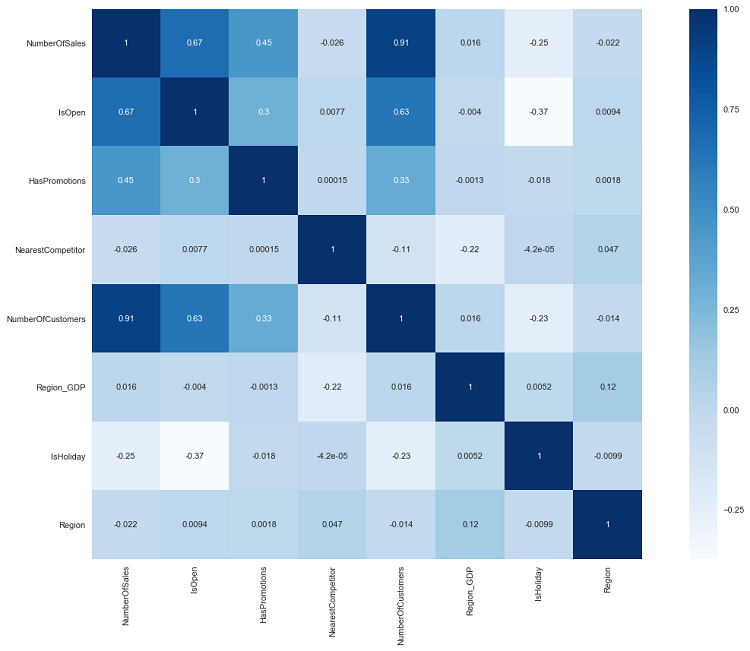
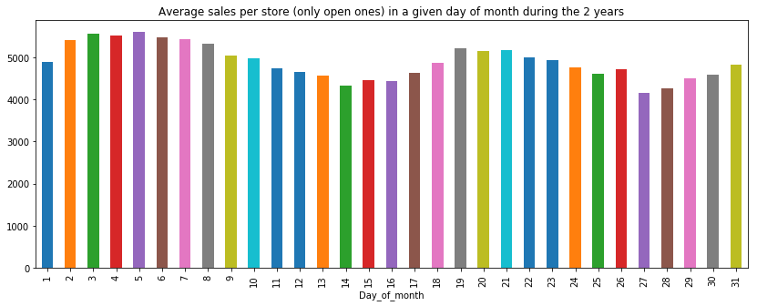
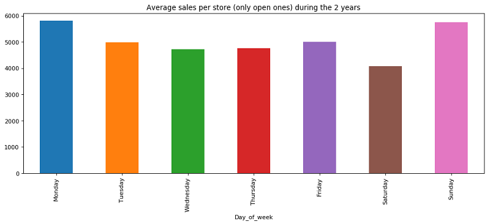
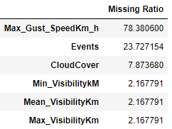
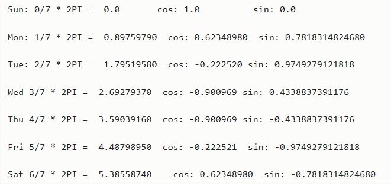
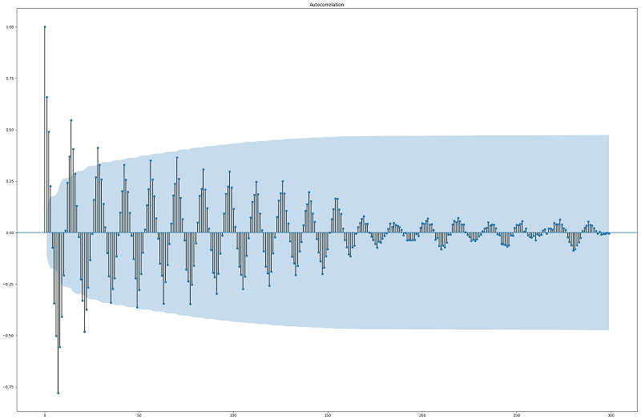
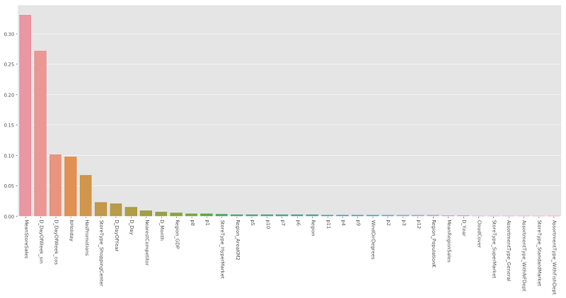
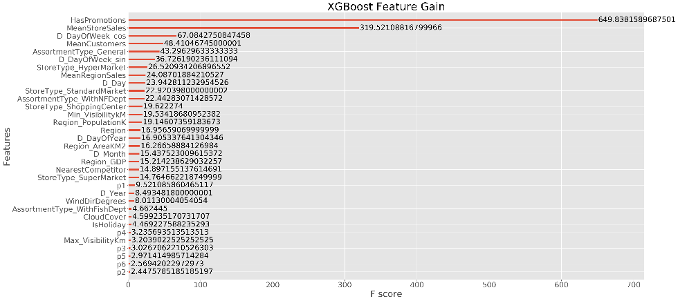
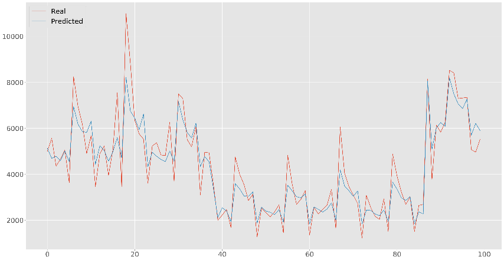

**Data Mining and Text Mining project report**

*Mirko Mantovani, Matteo Marziali, Piervincenzo Ventrella, Stefano
Cilloni*

This is the report of the project of Data Mining and Text Mining course
2018 at Politecnico di Milano

in collaboration with the *Bip.xTech* Company.

The Goal of the project was to provide a working forecasting model given
2 years of records and for each store predict the sum of product sold
for March and April 2018.

**1.0 Data Analysis and Visualization (*Notebook 1.0*)**

**1.1 Intro**

In this section we explored the Dataset and
its structure visualizing the attributes and studying their values’
distribution and correlation.

**1.2 Sales and customers distribution**

We first focused on the target NumberOfSales
and sequentially on NumberOfCustomers that results strongly correlated
with the former.

We immediately noticed the presence of several
days in which both attributes have a zero value. This is mainly due to
the fact that the stores were closed in those days. This is the reason
why during the preprocessing we decided to drop the instances in which
the attribute ‘IsOpen’ was 0, as well as the
probably erroneous rows in which the Sales and Customers are 0 even if
the store is open.

**1.3 Pearson's correlation coefficient**

Since knowing the data is the starting point of any analysis, proceeded
to identify the most important dependences between pairs of features, in
particular, what we were interested in was the correlation or
anticorrelation that the target ‘NumberOfSales’ had with the other
features.

We used first the Pearson's correlation coefficients in the Correlation
Matrix to initially try to spot the variables that could influence the
sales. The full details of the Dataset exploration process can be found
in the notebooks of chapter 1.

.

**2.0 Data preprocessing**

**2.1 Intro**

In this section we performed a strong data preprocessing both extracting
relevant attributes and performing imputation of the missing values.

Then we performed encoding of the categorical attributes. Lastly, we
performed Principal Component Analysis on the attributes related on the
weather condition. This choice was taken after noticing the large count
of attributes related to the weather and their weak correlation with the
target (so we decided to combine as many attributes as possible in order
to drop them from the dataset used as a train and then obtain a
less-variables better model.

The full details can be found in the notebooks of chapter 3.

**2.2 Features extraction**

We first extracted from the ‘Date’ attribute the attributes: ‘Day’,
‘Month’ and ‘Year’ that resulted useful for the next tasks.

Thanks to them we noticed that the volume of NumberOfSales remained
constant over the years and there was no strong trend components.

The mean value of NumberOfSales calculated on each Month for each store
remained quite constant with only little variations and a maximum on the
Month of December.

Moreover, we noticed the presence of a seasonal component during the
single month, as the below diagram shows, probably due to the fact that
promotions were introduced mainly at the beginning and in the middle of
the month or other factors not captured from the Data. The analysis on
the Dates can be found in the *Notebook 4.0*

We also noticed a high variance among the day of the week.

Two other attributes that resulted important for the implementation of
our model resulted in the Mean sales per Store and per Region over the 2
years of observations and the Mean Customers per store.

**2.3 Missing Values**

During this process we decided to:

-   Drop ‘Max\_Gust\_SpeedKm’ because of the fact of the high missing
    ratio and to not introduce strong Bias imputing it;

-   Impute the missing ‘Events’ with the label ‘NoEvents’;

-   Impute the missing ‘CloudCover’ with ‘0’ meaning zero level of
    coverage;

-   Min, Mean and Max visibility with the mode of the region in that
    day.

-   We then decided to drop Min and Max visibility because of their weak
    correlation with NumberOfSales and autocorrelation index of 1 with
    Mean Visibility.

**2.4 Encoding of categorical attributes**

During this process we decided to:

-   encode the categorical attributes ‘StoreType’ and ‘AssortmentType’
    using OneHotEncoding;

-   encode the attribute Events (Rain-Snow', 'Snow', 'Rain', 'None',
    'Fog-Rain', 'Fog-Rain-Snow',\
    'Fog', 'Rain-Thunderstorm’, …) extracting the basic attributes
    (Rain, Snow, Fog, None and Thunderstorm) and using them to encode
    the possible combinations (i.e. the categorical value ‘Fog-Rain’
    become: Fog=1, Rain=1, Snow=0, None=0, Thunderstorm=0)

-   encode the day of the week (M,T,W,TH,F,S,SU) mapping them on a
    circumference and using the attributes sin and cos of the angle to
    describe them. (Initially we performed OHE but we realized that
    using this different encoding we obtained better performances due to
    the fact that with the latter we were able to encode the information
    of the adjacency among the days of different weeks (i.e. Monday is
    close both to Tuesday of the same weak and Sunday of the previous
    weak):

-   

**2.5 Principal Component Analysis**

In order to reduce the number of attributes we performed principal
components analysis. We decided to process all the attributes that were
not much correlated with the target and to replace them in the dataset
with a number of principal components that guaranteed us not to lose too
much information, in terms of explained variance ratio.

In details, we processed 21 attributes through the PCA implemented by
the library ‘preprocessing’ of SciKitLearn and we found out that with 12
principal components the amount of information kept was around 95.5% as
you can check in the graph below. Then we created a new dataset with the
principal components instead of the processed attributes.

For further details you can take a look at the notebook
‘3.4\_Prepr\_train\_PCA’.

**3.0 Baseline - how to test? (*Notebook
7.2*)**

**3.1 Baseline**

The initial questions when starting the analysis were: what do we expect
to achieve in terms of error? Where do we start from? What would be the
results of our prediction if we had to predict right now in no more than
30 minutes and using no special algorithms? All this could be summarized
in: What is a baseline for our case? Given that the error function only
takes into consideration the monthly sales of a store, a good way to
start drafting a prediction after having seen how the trends of sales
behave over time would be to simply compute the average number of sales
of each shop in the months belonging to a pair of months in a given year
only considering the days in which the shop was open, and just assign to
the “test set”, which is composed by the same months of the following
year, the computed value, constant for each store and month. This is
what was done in *Notebook 7.2* by considering January and February 2017
and as test set January and February 2018. The result was a 5.3% BIP
error. This does not mean we would surely achieve such an error on any
month to be predicted because it was only tested on a pair of month and
could have been pure luck, but it gives possible starting point that we
can try to improve.

**3.2 Train-test split**

Initially we split train and test sets with the train\_test\_split in
model\_selection of SciKitLearn, the results were too optimistic and
then we decided to split in a way that would result in having a test set
similar to the one we were going to be evaluated on, so we selected some
test sets a pair of months in the 24 months of the train, in particular
we concentrated on the pairs that seemed more significant in our
analysis based on the real test we would have had to predict in the end
which are:

-   January and February 2018

-   March and April 2017

-   March and April 2016

The first one because it is the last 2 months we have and in a way this
captures the real test set we have to predict, the other two were chosen
because the real test set is for March and April.

**4.0 Autocorrelation - lag vars (*Notebook 4.1*)**

**4.1 Intro**

A big part of our feature engineering process was on Autocorrelation
analysis and lag variables extraction. This seemed like the right
direction that would lead to a better prediction since we noticed that
the sales in a given day were highly correlated with the sales some of
the previous days.

**4.2 Correlogram**

By plotting the correlogram (ACF), which shows the correlation of each
lagged observation and whether or not the correlation is statistically
significant, of the seasonality adjusted (removing seasonality and
trend) time series, we were able to discover the best lag variables to
extract, the most significant one resulted to be
7,14,1,2,9,8,6,15,21,13,20 days before the current day, we extracted all
of them and started testing the goodness of the new features on the
prediction.

**4.3 The problem**

When we tried to predict with the new features the results were
promising, the problem was that we could not compute the lag variables
on the real test set, so we tried to predict day by day and computing
the lag variables on the basis of the previously predicted Sales. The
overall prediction gave very bad results, and this is probably due to
the fact that the training was done of “perfect” lagged sales, and they
were considered by the models one of the best attributes (thus highly
weighted and considered. Whereas when predicting they were only an
approximation and give high importance (in practice base most of the
model) to inaccurate values intuitively is not likely to lead to good
performances. At that point we dropped all the attributes and completely
changed direction.

**5.0 Random Forest model (*Notebook 5.3*)**

**5.1 Intro**

A random forest regressor is a meta estimator that fits a number of
classifying decision trees on various sub-samples of the dataset and use
averaging to improve the predictive accuracy and control over-fitting.

**5.2 Feature selection**

The feature selection was performed both by analyzing the
feature\_importances\_ of the SciKitLearn’s implementation of
RandomForestRegressor and by increasingly excluding the least important
features that were detected by the model and plot after the training of
the model

**5.3 Parameters tuning**

Before building the model, we tried to find effective parameters for the
RandomForestRegressor by analyzing the validation curves of three main
parameters: max\_depth, n\_estimators and max\_features.

In practice, we plotted the influence of a single hyperparameter on the
training score and the validation score to find out whether the
estimator is more likely to lead to overfitting for some values.

**5.4 Results**

Different results with respect to different test sets lead us to the
conclusion that RandomForestRegressor is strongly related in terms of
performances to the data used to test the model.

In fact, we get very good results by testing on the bimester March-April
both 2016 and 2017 or January-February 2017, but on the other hand, the
BIP error computed by testing on January-February 2018 gives us terrible
performances.

Such surprising outcome lead us to being stuck in choosing which results
to trust more.

**6.0 XGBoost model (*Notebook 6.4*)**

**6.1 Intro**

eXtreme Gradient Boosting (**XGBoost**) is an implementation of gradient
boosted decision trees designed for speed and performance. This notebook
implements the final model of **XGBoost** used in our analysis. Since it
was not easy to integrate our custom evaluation function (BIP error), we
tried to minimize many built-in evaluation metrics of the **XGBoost**
library (mae, rmse..), and then used the one that produced the best
results in term of BIP error, which in this case was rmse.

**6.2 Feature selection**

The feature selection was performed both by using the feature\_selection
library of SciKitLearn and by increasingly excluding the least important
features that were detected by the model and plot after the training of
the model

**6.3 Hyperparameters Tuning**

The tuning of the Hyperparameters for **XGBoost** was done using the
RandomizedSearchCV method and using SciKitLearn wrapper of **XGBoost**
(XGBRegressor) with a 5-fold cross-validation on 30% of the train test
and providing it the parameters: gamma, learning\_rate, max\_depth,
reg\_alpha onto which apply the Grid Search. The best parameters it
found were: {'gamma': 14.557397447034148, 'learning\_rate':
0.17070528151248315, 'max\_depth': 16, 'reg\_alpha':
11.010959407512171}, however, testing the parameters with our train-test
split policy did not produce better results than the parameters found by
manually try some combinations, thus, in the end we modified them.

**6.4 Results **

The obtained results were promising, and even if to obtain good results
in term of BIP error we had to bring to extreme values some
hyperparameters, leading to a visible overfitting, we only cared about
having the best possible BIP
error.

We can notice that the real results has more variance with respect to
the predicted ones, this is probably due to the fact that we introduced
an important attribute which is the mean sales of a store, this squeezes
everything and makes the prediction fall in a small range around the
average sales per day, but this is what we want since we don't want to
minimize a function that takes into account errors on single days but it
looks at the monthly sales.

**7.0 Final Model and conclusions**

**7.1 Intro**

The last important decision to make was which of the final models to
use. Further studies were necessary to decide this.

**7.2 Model comparison** (*Notebook 8.0*)

To compare the models, we plotted the predicted number of sales for each
store of different models and the real sales as bar plots. In this way
we were able to see the difference in the predictions of the various
models, if there were anomalous behaviors in a specific month or for
some specific stores.

**7.3 Random Forest – XGBoost ensemble (*Notebook 7.1)***

For
the final prediction, since we had already observed that one model was
better at predicting for some specific test sets, and the other for
other test sets, we decided to try average the predictions of each day
made by the two models. By doing this on some test sets the error was
almost always slightly less than the mean of the errors of the two
separate models. The final
decision was the one to use this more robust model to predict on the
real test set instead of trying to guess which of the two models could
give us the best result for, we thus reduced the risk to do choose the
worst model but also lost the chance to do maybe much better.
